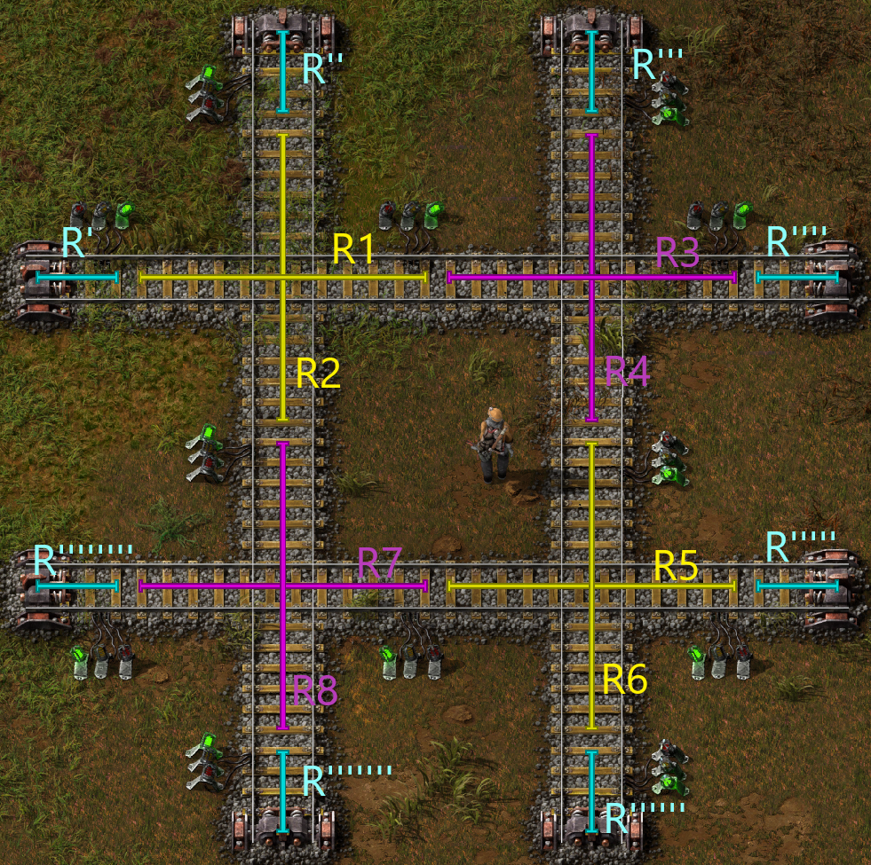

# factorio-train-analyser
A tool to analyse train blueprints from factorio to recognize deadlocks and performance issues. For now this tool can only analyse wether a deadlock is possible inside a given train section or not.
If you are trying to understand the alogrithm behind this, you can read our [paper](./docs/studienarbeit.pdf) inside the docs folder.
## Requirements
The project has been build and developed using the following versions. It might work with lower version.
- Java 17
- Gradle 8.1
## Start-Up
There are multiple ways how you can run the application. We recommend the first one if you are just trying to run this application
### Build and run
In the first step, we will build the app from the sources.
- ```./gradlew build```
After that we run the jar-file and add a txt-file which includes the blueprint you want to analyze.
- ```java -jar ./app/build/libs/app.jar <path/to/blueprint.txt>```
The program will generate a output.json which includes all the deadlock combinations and the graph data structure that has been generated. It will also tell you inside the console whether a deadlock was found or not.
### Run in debug mode
If you are trying to debug the application you might need to use this mode. The diffrence to the normal mode is that the blueprint is inside tha App.java as a variable.
- change inside the App.java the isInDebug Flag to true
- replace the placeholder debugBlueprint String with yours
- ```./gradlew run```
### Run
If you dont want to build it yourself, you can download the binaries from the release page.
To run it execute:
- ```java -jar ./app/build/libs/app.jar <path/to/blueprint.txt>```
## Example

