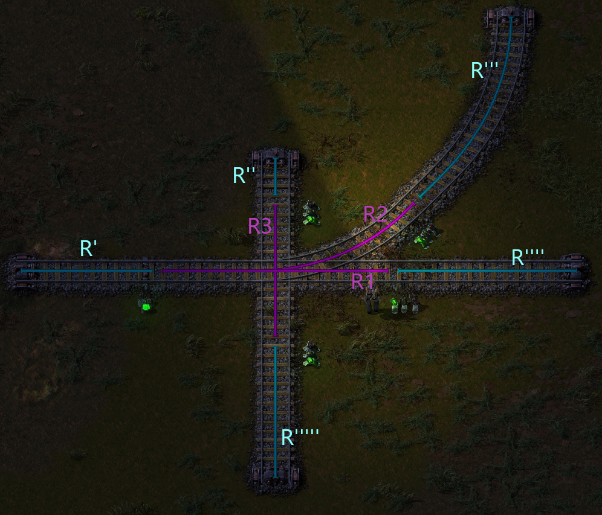
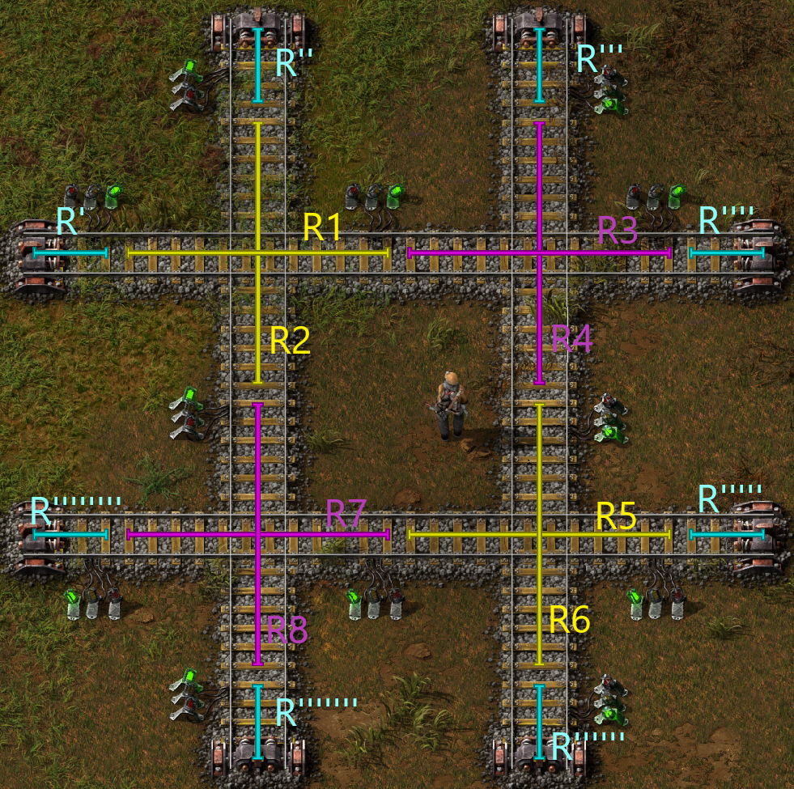

# Term defintion

## Edge
A edge is summation of multiple train tracks. The edge start and ends on a (chain)signal or if it ends. R1, R2, R3, R', R'', R''', R'''', R''''' are edges in the image above. R' to R''''' are special edges. They just end or start without a signal. In our deadlock analysis we assume that these special edges are always free.

## Section
A section consists out of multiple edges. A section is definied by (chain)signals.  \
In our example there is a section S1 = {R1, R2, R3} and a section S' = {R', R'', R''', R'''', R'''''}. In our deadlock analysis we use this to know where we dont have to simulate trains. If there is a train in R1, we know that there cannot be a train in R2 and R3. \
S' is again a special section that consists out of edges that are always free (R', ...). We assume that S' is always free because it consists out of edges that are always free.

## Directions
For our analysis we generate a graph that emulates the possible movement directions of the given blueprint. This is the graph for our example: \
R' -> R1, R2 \
R1 -> R'''' \
R2 -> R''' \
R''''' -> R3 -> R'' \
We use this to simulate where the train can be blocked. For example: A train is in R'. We now know he can only drive into R1 and R2. R1 AND R2 are in S1. That means we have to simulate that either R1, R2 or R3 are blocked by another train.

## Dependencies
The use of chain signals allows the train to look ahead and only drive into an section if the following section is also free. Thats why we need to generate a dependency graph to simulate this behavior. In our example it looks like this: \
R1 -> R'''' \
R2 -> R''' \
R3 \
R' \
R'' \
R''' \
R'''' \
R''''' \
So if our trains wants to drive into R1, R'''' also has to be free. This is trivial in this example because we said earlier that R'''' is always free.

## Deadlock Example

### Edges
R1, R2, R3, R4, R5, R6, R7, R8, R', R'', R''', R'''', ...
### Section
S' = {R', R'', R''', ...} \
S1 = {R1, R2}; S2 = {R3, R4} \
S3 = {R5, R6}; S4 = {R7, R8}
### Directions
R'''' -> R3 -> R1 -> R' \
R'''''''' -> R7 -> R5 -> R''''' \
R'''''' -> R6 -> R4 -> R''' \
R'' -> R1 -> R8 -> R'''''''
### Dependencies
there are no chain signals -> no dependencies
### Example
Trains can be compared to processes or threads. A process uses certain resources and requests resources. A train is in a section and he wants to drive to another section. Our goal is to create a resource graph of what resource a train has and which resource a trains wants.
#### To start we define 4 trains
T0 = R3 -> R1 //T0 is in edge R3 and wants to drive into edge R1 \
T1 = R2 -> R8 \
T2 = R7 -> R5 \
T3 = R6 -> R4 \
Now we create our resource graph. To do this we lookup in which Section S the trains is and in which Section S the trains wants to drive in.
##### Example
T0 is in S2 and requests S1: S2->T0->S1
#### Full graph
S2 -> T0 -> S1 -> T1 -> S4 -> T2 -> S3 -> T3 -> S2 \
We now have a loop in our graph which means this possible train configuration creates a deadlock of our intersection.